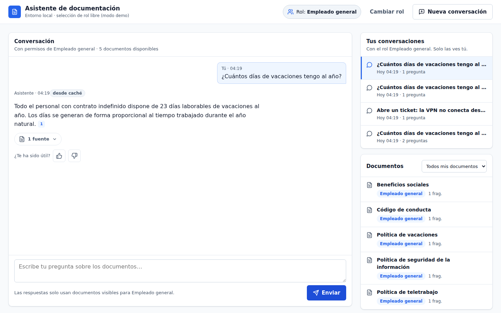
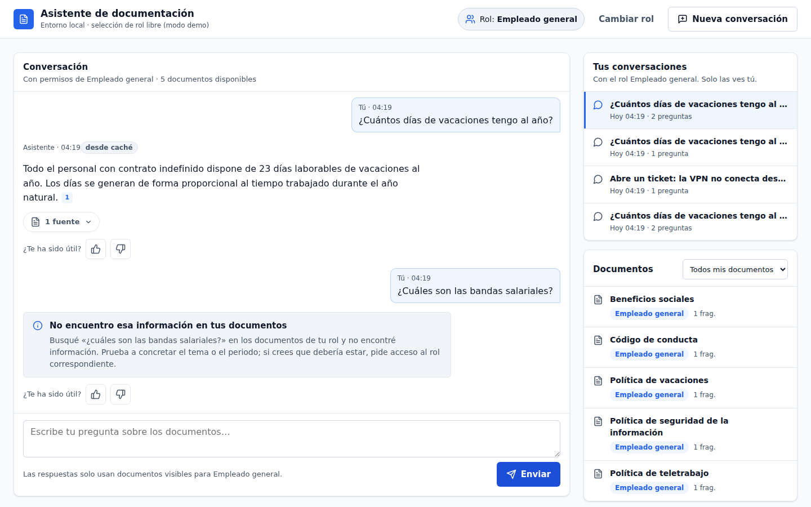
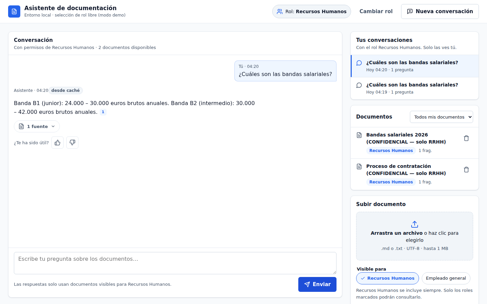
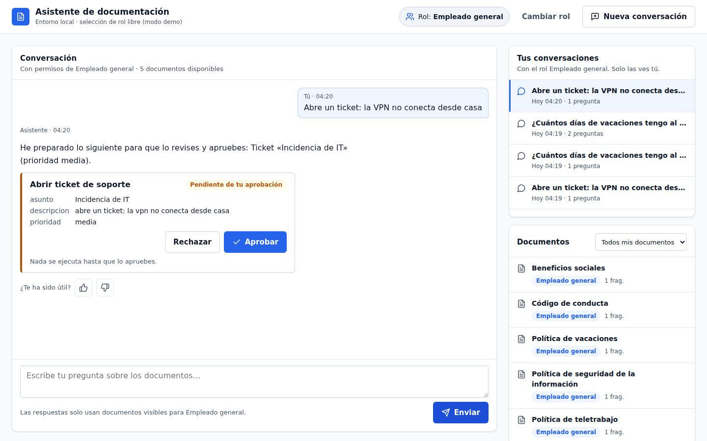

# Asistente RAG agéntico seguro

Asistente interno en el que cada empleado pregunta en lenguaje natural por los documentos y
datos de la empresa y **solo obtiene respuestas de lo que su rol permite ver**, siempre con
citas.

- **Permisos en el dato**: filtro por rol en el índice y verificación de cada fragmento contra
  el registro antes de que el modelo lo vea.
- **Guardrails** de entrada y salida (inyección, PII, fugas) y caché que respeta los permisos.
- **Agente LangGraph** con herramientas: búsqueda, datos internos y acciones con aprobación humana.
- **Auditoría** de toda consulta, trazas en LangSmith y evaluaciones por capas en CI.
- **Modelos** de Azure OpenAI u OpenAI (o cualquier endpoint compatible).



| Sin acceso: no se filtra nada | Recursos Humanos ve sus documentos | Acción con aprobación |
|---|---|---|
|  |  |  |

## Probar en local

Requisitos: [uv](https://docs.astral.sh/uv/) y Docker Desktop abierto. Elige de dónde salen los
modelos con `MODELOS_PROVEEDOR` en `.env`:

| | `openai`: OpenAI o compatible | `azure` (por defecto): Azure OpenAI |
|---|---|---|
| Necesitas | `OPENAI_API_KEY` (y `OPENAI_BASE_URL` si no es OpenAI) | Suscripción activa, [Azure CLI](https://learn.microsoft.com/cli/azure/install-azure-cli) con `az login` y [Terraform](https://developer.hashicorp.com/terraform) |

```bash
git clone https://github.com/csr9497/agente-rag-seguro.git && cd agente-rag-seguro
make instalar           # comprueba requisitos, instala dependencias y crea .env
# edita .env: MODELOS_PROVEEDOR y la clave (opción openai)
make verificar-modelos  # credenciales, saldo, modelos y capacidades
make levantar           # app + documentos de ejemplo → http://localhost:8080
```

Elige un rol en la web (Empleado general, Recursos Humanos, Finanzas, Administrador) y
pregunta. `make apagar` lo detiene todo (con Azure, también borra los modelos).
Sin modelos, `make up` arranca la interfaz y los permisos (las respuestas dan 503).

**App local contra la nube**: tras `make desplegar`, `make local-nube` arranca la app en tu
equipo (http://localhost:8090) usando los modelos, AI Search, Blob y Content Safety de Azure,
con base de datos local.

**En un servidor remoto** los mismos comandos funcionan igual. Sin login, la app solo escucha
en `127.0.0.1` del servidor (no se expone a la red): ábrela desde tu equipo con un túnel SSH
(`make accesos` imprime el comando) y usa las mismas URLs de `localhost`. Para publicarla con
login, despliégala en Azure.

## Desplegar en Azure

Desde tu equipo, con `az login`, Terraform y Docker: `make desplegar`. Sin más configuración
queda en **modo prueba** (solo accesible desde tu IP, sin login); con una OAuth App de GitHub
en `.env`, pública con login. También con GitHub Actions (credenciales como secrets del
repositorio y `DEPLOY_AZURE=true`).

La web queda pública **con login obligatorio** (GitHub; Entra ID opcional): sin roles no se ve
nada, y los administradores asignan roles a cada persona desde la app. Pasos, costes y
problemas frecuentes: [docs/despliegue.md](docs/despliegue.md).

## Comandos

| Comando | Qué hace |
|---|---|
| `make levantar` · `make apagar` | Entorno local completo · pararlo |
| `make desplegar` · `make destruir-nube` | Publicar en Azure · borrarlo |
| `make local-nube` | Tu equipo contra los recursos de Azure |
| `make test` · `make evals-simulado` | Tests · gate de evaluaciones con modelos simulados |
| `make evals BASE_URL=…` | Evaluaciones con modelos reales contra una app en marcha |

Todos los comandos y los valores que necesita cada uno: [docs/comandos.md](docs/comandos.md).

## Documentación

| | |
|---|---|
| [docs/comandos.md](docs/comandos.md) | Todos los `make` y los valores a configurar en cada caso |
| [docs/modelos.md](docs/modelos.md) | Proveedores de modelos, setup de cada uno y errores (saldo, credenciales, capacidades) |
| [docs/despliegue.md](docs/despliegue.md) | Despliegue en Azure paso a paso |
| [docs/arquitectura.md](docs/arquitectura.md) | Grafo del agente, seguridad, API, pruebas, observabilidad e infraestructura |
| [docs/herramientas.md](docs/herramientas.md) · [docs/studio.md](docs/studio.md) | Herramientas del agente y LangGraph Studio |
| [CLAUDE.md](CLAUDE.md) | Reglas del proyecto |

Stack: Python 3.12 · LangGraph · FastAPI · Azure OpenAI / OpenAI · AI Search / Qdrant ·
SQLite / PostgreSQL · Redis · Terraform · GitHub Actions.
